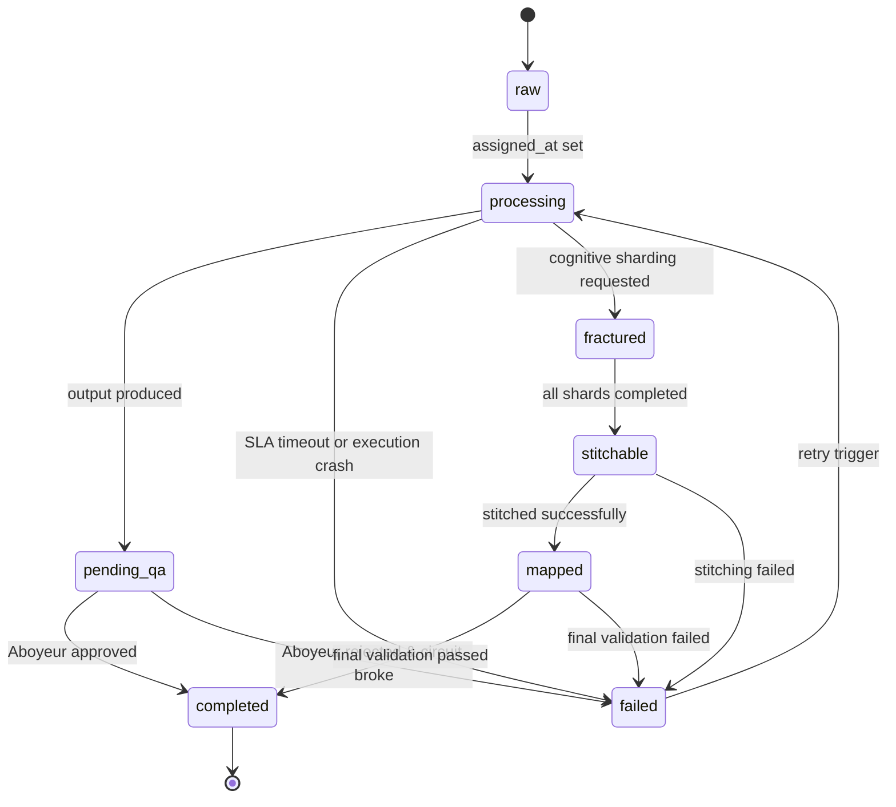

# XP-Arc System Architecture
*Canonical System Specification & Codebase Mapping*

This document is the single source of truth mapping the theoretical XP-Arc spec to the concrete reference implementation. It defines the schemas, state transitions, station roles, and configuration parameters exactly as they are implemented in code.

---

## 1. Core Primitives & State Surface

The XP-Arc coordination protocol is built on a single, shared SQLite database running in WAL (Write-Ahead Logging) mode. All inter-agent communication, routing, and auditing flow through this surface.

### 1.1 The Intelligence Pool Schema

The canonical schema is defined in `xp_arc/core/pool.py`.

#### `entities` Table

| Column | SQL Type | Runtime Description |
|---|---|---|
| `id` | `INTEGER PRIMARY KEY` | Auto-incrementing unique identifier. |
| `type` | `TEXT NOT NULL` | Entity type identifier (e.g., `url`, `domain`, `shard`). |
| `value` | `TEXT NOT NULL` | Main payload of the entity. |
| `status` | `TEXT NOT NULL` | Flow status (Default: `raw`). |
| `payload_hash` | `TEXT NOT NULL` | Timing-immutable SHA-256 hash of the JSON string `{"type": type, "value": value}`. |
| `station` | `TEXT` | ID of the station currently processing or that completed the entity. |
| `confidence` | `REAL` | Confidence score (0.0 to 1.0) returned by the station. |
| `notes` | `TEXT` | Execution notes, findings, or rejection explanations. |
| `sla_seconds` | `INTEGER` | Time limit in seconds for station processing. |
| `assigned_at` | `TEXT` | UTC ISO-8601 timestamp when station assignment began. |
| `completed_at` | `TEXT` | UTC ISO-8601 timestamp when execution finalized. |
| `created_at` | `TEXT` | UTC ISO-8601 timestamp when entity was inserted. |
| `aboyeur_signature`| `TEXT` | Authenticated approval signature from the Expeditor/Aboyeur (`ABOY-{hash}`). |
| `fallback_role` | `INTEGER` | Boolean flag (0 or 1) indicating if a fallback station handled the entity. |
| `fracture_id` | `TEXT` | UUID linking sibling shards created via Cognitive Sharding. |
| `parent_task_id` | `INTEGER` | ID of the parent entity that spawned this target. |
| `rejection_count` | `INTEGER` | Count of failed Aboyeur validation attempts. |
| `max_rejections` | `INTEGER` | Rejection threshold before circuit breaker fail-and-escalate is triggered (Default: 3). |
| `sla_suspended` | `INTEGER` | Boolean flag indicating if SLA measurement is paused. |
| `crawl_depth` | `INTEGER` | Tracked depth of web crawling (Forager specific). |
| `max_crawl_depth` | `INTEGER` | Maximum crawl depth limit for this subtree. |
| `root_task_id` | `INTEGER` | Root entity ID of the snowball chain. |
| `cascade_depth` | `INTEGER` | Distance from the snowball root entity (Default: 0). |
| `spawn_chain` | `TEXT` | JSON array of ancestor IDs tracing back to root. |

#### `edges` Table
Tracks inferred or extracted relationships between entities.
- `source` (TEXT): Source entity value.
- `relationship` (TEXT): Relationship type (e.g., `links_to`, `subdomain_of`).
- `target` (TEXT): Target entity value.

#### `station_registry` Table
Catalogs active stations, capabilities, and authentication keys.
- `station_id` (TEXT UNIQUE): Unique station ID.
- `name` (TEXT): Display name.
- `handles_types` (TEXT): JSON array of entity types the station accepts.
- `hmac_key` (TEXT): Derived HMAC authentication secret.
- `status` (TEXT): Station state (`active` / `inactive`).
- `is_primary` (INTEGER): Flag (1 = primary role, 0 = fallback).

---

## 2. Canonical Status Flow & Transitions

Status transitions are strictly validated at the pool layer (`pool.py` `VALID_TRANSITIONS`). Attempting a transition not listed below triggers a `status_violation` log event and is rejected.



### Transition Verification Exceptions
- **`mark_status()`**: A development bypass exists in `pool.py` to allow direct `raw → completed` state updates during tests. This method MUST NOT be used in production.

---

## 3. Station Role Registry

The reference implementation supports **13 core stations** plus **3 subpackage stations** (Asset Engine, Competitive Intel, DRAGON). The list of roles defined in the protocol maps directly to these files:

### 3.1 Core Stations (xp_arc.stations.*)

| Station ID | Class Name | File | Primary / Fallback | Handles Types | Critical? |
|---|---|---|---|---|---|
| `forager` | `TheForager` | `xp_arc/stations/forager.py` | Primary | `url` | True |
| `analyst` | `TheAnalyst` | `xp_arc/stations/analyst.py` | Primary | `domain` | True |
| `sentinel` | `TheSentinel` | `xp_arc/stations/sentinel.py` | Primary | `pool_health` | True |
| `plongeur` | `ThePlongeur` | `xp_arc/stations/plongeur.py` | Primary | `garbage_collection`| True |
| `librarian` | `TheLibrarian` | `xp_arc/stations/librarian.py` | Primary | `document`, `text` | False |
| `cartographer`| `TheCartographer`| `xp_arc/stations/cartographer.py`| Primary | `network_map` | False |
| `auditor` | `TheAuditor` | `xp_arc/stations/auditor.py` | Primary | `audit_log` | False |
| `warden` | `TheWarden` | `xp_arc/stations/warden.py` | Primary | `security_policy`| False |
| `amphithere` | `TheAmphithere` | `xp_arc/stations/amphithere.py` | Fallback (Forager) | `url` | True |
| `hydra` | `TheHydra` | `xp_arc/stations/hydra.py` | Commis (Analyst) | `domain` | False |
| `salamander` | `TheSalamander` | `xp_arc/stations/salamander.py` | Fallback (Librarian)| `document`, `text` | False |
| `herald` | `TheHerald` | `xp_arc/stations/herald.py` | Primary | `notification` | False |
| `dossier` | `TheDossier` | `xp_arc/stations/dossier.py` | Primary | `identity_profile`| False |

*Note: In Brigade Compression mode, all stations marked `Critical: False` are unregistered, leaving only `Critical: True` stations active.*

### 3.2 Subpackage Stations

| Station ID | Class Name | Package | Handles Types | Critical? |
|---|---|---|---|---|
| `asset-engine` | `AssetEngine` | `xp_arc.asset_engine` | `asset`, `style_genome`, `concept` | False |
| `competitive-intel` | `CompetitiveIntelStation` | `xp_arc.competitive_intel` | `competitive_gap`, `watchlist_item` | False |
| `dragon` | `DragonStation` | `xp_arc.monitoring` | `visualization`, `metrics` | False |

---

## 4. Security & Cryptographic Boundaries

### 4.1 Write Authentication (HMAC-SHA256)
- **Mechanism**: Every writing call (`add_entity`, `transition_status`, `add_edge`, etc.) is signed using HMAC-SHA256.
- **Key Store**: Station keys are generated and persisted in `station_keys.json`.
- **Validation**: If a station has no key registered, writes proceed unsigned (development mode). If a key exists, all writes must supply a timing-safe MAC computed over the payload string:
  `{method_name}:{arg1}:{arg2}...`

### 4.2 Aboyeur QA Signatures
- **Approved entities** are signed by the Expeditor using a HMAC signature prefixed with `ABOY-`.
- **Key Configuration**: The signing key is hardcoded to `xp-arc-aboyeur-v1` in `aboyeur.py`. For production deployments, this key should be overridden via an environment variable.

### 4.3 D2 Output Sanitization
- Located in `xp_arc/core/sanitization.py`.
- Formats arbitrary entity data for safe rendering in D2 text-based diagrams. Node IDs are forced to lowercased alphanumeric/hyphens to avoid parsing collisions in downstream render engines.

---

## 5. Codebase Map (v0.2.1)

```
xp-arc/
├── xp_arc/
│   ├── __init__.py              # Package root, version = "0.2.1"
│   ├── core/
│   │   ├── __init__.py
│   │   ├── pool.py              # IntelligencePool — SQLite WAL state machine
│   │   ├── station.py           # BaseStation abstract class
│   │   ├── executive.py         # ExecutiveChef — typed routing
│   │   ├── aboyeur.py           # Aboyeur QA validation + signatures
│   │   ├── authorization.py     # HMAC write auth + station keys
│   │   ├── fracture.py          # Cognitive Sharding (Fracture Protocol)
│   │   └── sanitization.py      # D2 graph export sanitization
│   ├── stations/
│   │   ├── __init__.py
│   │   ├── forager.py
│   │   ├── analyst.py
│   │   ├── sentinel.py
│   │   ├── plongeur.py
│   │   ├── librarian.py
│   │   ├── cartographer.py
│   │   ├── auditor.py
│   │   ├── warden.py
│   │   ├── amphithere.py
│   │   ├── hydra.py
│   │   ├── salamander.py
│   │   ├── herald.py
│   │   └── dossier.py
│   ├── monitoring/
│   │   ├── __init__.py
│   │   ├── zorans_law.py        # S quotient + PRO metrics
│   │   └── spazzmatic.py        # Rule-based adversarial review
│   ├── broker.py                # OBSOLETE — legacy Redis/DuckDB broker
│   ├── broker_client.py         # OBSOLETE
│   ├── asset_engine/            # Subpackage: Evolutionary asset pipeline
│   │   ├── __init__.py
│   │   ├── api_agent/
│   │   ├── asset_store/
│   │   ├── browser_agent/
│   │   ├── concepts/
│   │   ├── config.py
│   │   ├── evolution/
│   │   ├── prompt_engine/
│   │   ├── style_genomes/
│   │   ├── templates/
│   │   ├── themes/
│   │   └── unity_pipeline/
│   ├── competitive_intel/       # Subpackage: Competitive intelligence
│   │   ├── __init__.py
│   │   ├── config.py
│   │   ├── station.py
│   │   └── station_main.py
│   └── __init__.py
├── pyproject.toml               # Single source of truth for all deps
├── requirements.txt             # Dev/test deps only (pytest, bandit)
├── .gitignore                   # Runtime artifact exclusions
├── README.md                    # Project overview + subpackage guide
├── ARCHITECTURE.md              # This file
├── STATUS.md                    # Implementation matrix
├── DEPLOY.md                    # Deployment guide
├── WHITEPAPER.md                # Full protocol spec
├── CONSTITUTION.MD              # Operational law
├── LEGAL.md                     # Legal framework
├── LICENSE                      # Apache License 2.0
├── NOTICE                       # Copyright + trademark reservation
├── SPEC.md                      # Asset Engine spec
├── PROMPT_LIBRARY.md            # Asset Engine prompts
├── FILTER_SAFE_PROMPTS.md       # Asset Engine safe prompts
├── install.sh
├── run_kitchen.py               # One-shot pipeline runner
├── run_persistent.py            # Persistent daemon + HTTP API
├── dragon/                      # DRAGON dashboard (static + live)
├── tests/
├── config/
├── sql/
├── templates/
├── data/
├── reports/
├── docs/
├── specs/
└── asset-engine/                # Asset Engine docs (moved from subdir)
    ├── SPEC.md
    ├── PROMPT_LIBRARY.md
    ├── FILTER_SAFE_PROMPTS.md
    └── config.yaml
```

---

## 6. Version Matrix

| Component | Version | Notes |
|---|---|---|
| XP-Arc Protocol | 0.2.1 | Consolidated subpackages |
| Constitution | 1.6 | Apache 2.0 license, SQLite WAL substrate |
| Pool Schema | v2 | Includes cascade lineage columns |
| Aboyeur Protocol | 1.0 | Schema in `docs/aboyeur-protocol-v1.json` |
| Asset Engine | 0.1.0 | Subpackage under `xp_arc.asset_engine` |
| Competitive Intel | 0.1.0 | Subpackage under `xp_arc.competitive_intel` |
| DRAGON Dashboard | 0.2.0 | Live polling via `run_persistent.py` |
| Broker | 0.0.0 | OBSOLETE — remove in v0.3 |
| License | Apache-2.0 | Relicensed from MIT 2026-08-19; see WHITEPAPER §13 |

---

*Last updated: 2026-08-23 — license row updated to Apache-2.0; see WHITEPAPER.md §13 for the relicense changelog. Other sections carried forward from the 2026-07-21 v0.2.1 consolidation and known to be stale against current code — see STATUS.md.*
